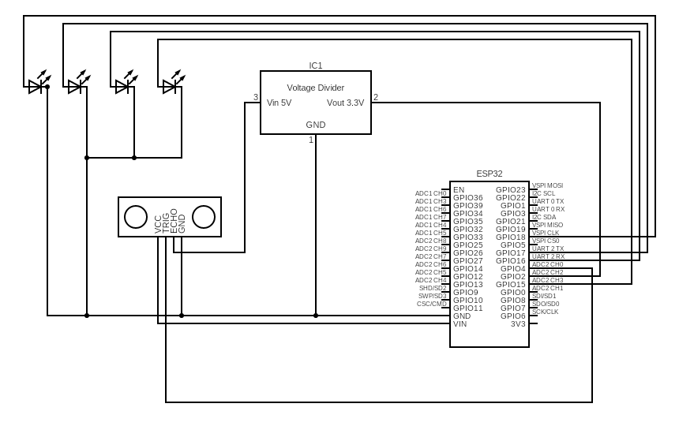

#  ESP32-S3 Ultrasonic Distance Indicator (HC-SR04 + 4 LEDs)

A simple and practical ESP32-S3 project that uses an **HC-SR04 ultrasonic sensor** to measure distance and control **four LEDs** based on the detected range.
This project is perfect for learning distance sensing, GPIO control, and real-time feedback on embedded hardware.

---

##  Features

* Accurate distance measurement using **HC-SR04**
* Four-stage LED indicator:

  | Distance (cm) | LED     |
  | ------------- | ------- |
  | `< 40`        | LED1 ON |
  | `< 30`        | LED2 ON |
  | `< 20`        | LED3 ON |
  | `< 10`        | LED4 ON |
* LEDs switch **ON/OFF automatically** based on thresholds
* Clean serial output displaying distance in centimeters
* Fully compatible with **ESP32-S3 N16R8**

---

##  Hardware Requirements

| Component                 | Quantity  |
| ------------------------- | --------- |
| ESP32-S3 N16R8 Dev Board  | 1         |
| HC-SR04 Ultrasonic Sensor | 1         |
| LEDs (any color)          | 4         |
| 220Ω resistors (for LEDs) | 4         |
| Breadboard + jumper wires | As needed |

⚠️ *Important:* The HC-SR04 **Echo pin outputs 5V**, but ESP32-S3 GPIOs are **3.3V only**.
Use a **voltage divider** (recommended 1kΩ + 2kΩ) on the Echo pin.

---

##  Pin Connections

### ESP32-S3 → HC-SR04

| HC-SR04 Pin | ESP32-S3 Pin                 |
| ----------- | ---------------------------- |
| VCC         | 5V or 3.3V*                  |
| GND         | GND                          |
| Trig        | GPIO 6                       |
| Echo        | GPIO 5 (via voltage divider) |

> *Feeding HC-SR04 with 3.3V works reliably in most cases and ensures safe Echo voltage.*

---

### ESP32-S3 → LEDs

| LED  | ESP32-S3 Pin |
| ---- | ------------ |
| LED1 | GPIO 15      |
| LED2 | GPIO 16      |
| LED3 | GPIO 17      |
| LED4 | GPIO 18      |

Each LED → 220Ω resistor → GND.

---

##  Code Used in This Project

This repository includes the following tested working code:

* Reads distance from HC-SR04 using `pulseIn()`
* Calculates distance using `duration / 58.2` (same as original Arduino method)
* Controls 4 GPIO LEDs based on distance thresholds
* Prints live distance values to serial monitor

---

##  Software Requirements

Install the following:

### ✔ Arduino IDE

Download from: [https://www.arduino.cc/en/software](https://www.arduino.cc/en/software)

### ✔ ESP32 Boards Package

In **Boards Manager**, install:

```
ESP32 by Espressif Systems
```

### ✔ No extra libraries required

This project uses only:

```cpp
#include <Arduino.h>
#include <Wire.h>
```

Both are built-in.

---

##  Circuit Diagram




##  Serial Monitor Output Example

```
Distance: 28 cm
Distance: 25 cm
Distance: 18 cm
Distance: 9 cm
```

---


##  How It Works (Simple Explanation)

1. ESP32 sends a **10µs trigger pulse** to the ultrasonic sensor.
2. HC-SR04 sends a sound wave and waits for it to bounce back.
3. The Echo pin returns a pulse whose width represents distance.
4. ESP32 calculates:

```
distance_cm = duration / 58.2;
```

5. LEDs turn ON based on thresholds.
6. Distance is printed to the serial monitor.

---

##  Future Improvements

* Add buzzer for alarm mode
* Display distance on OLED
* Add Wi-Fi + MQTT reporting
* Add smoothing filter for stability

---

## 📜 License

MIT License — free to use in your projects.
